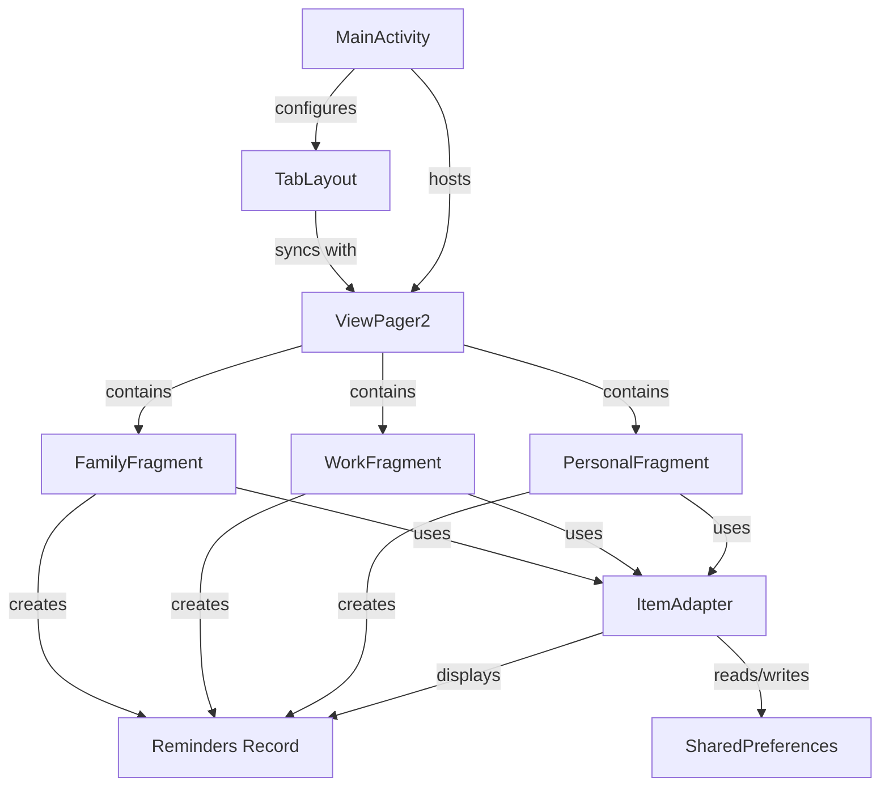
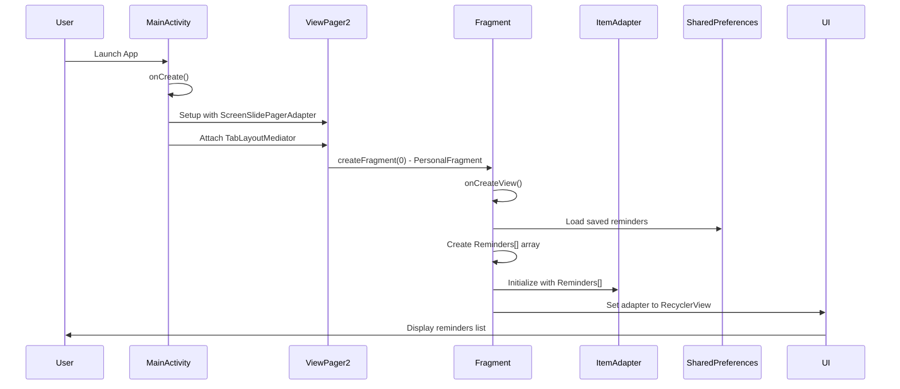
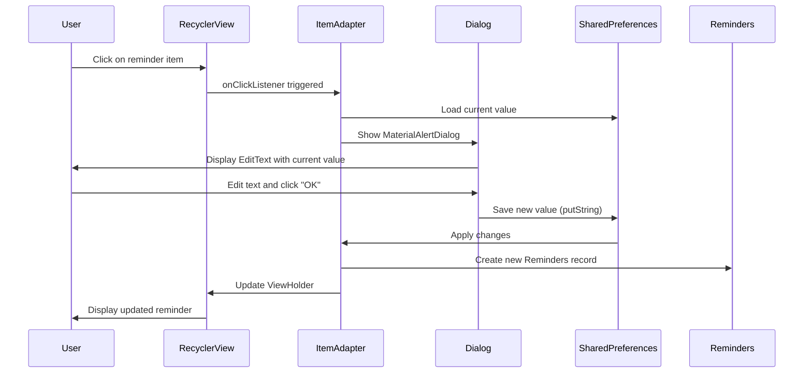
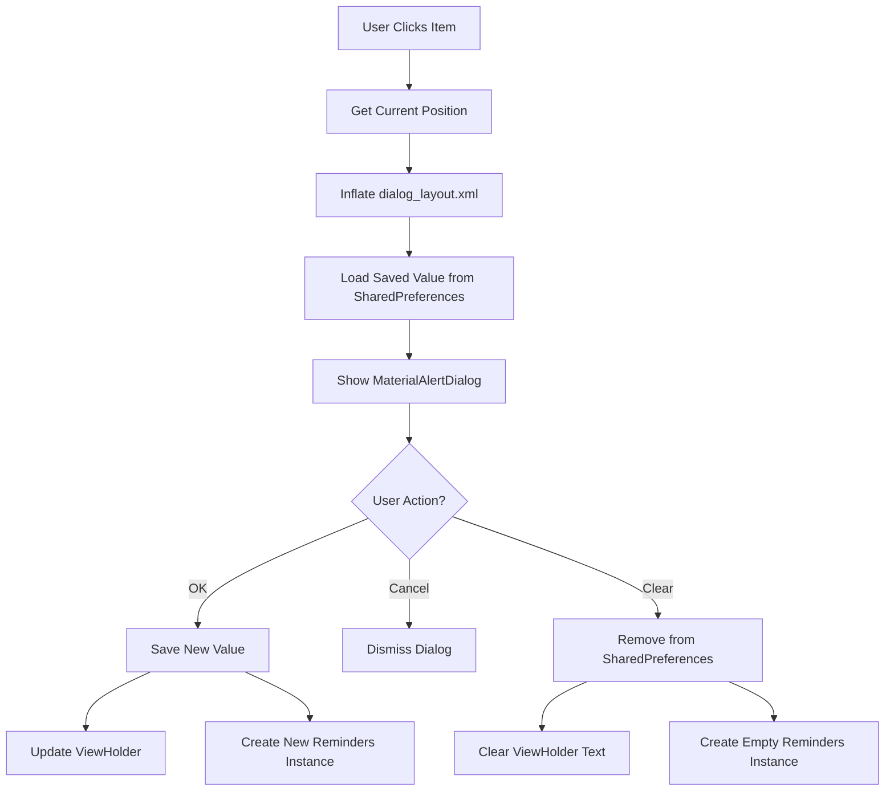
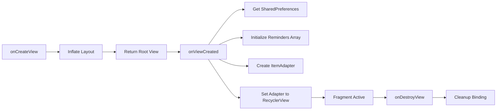
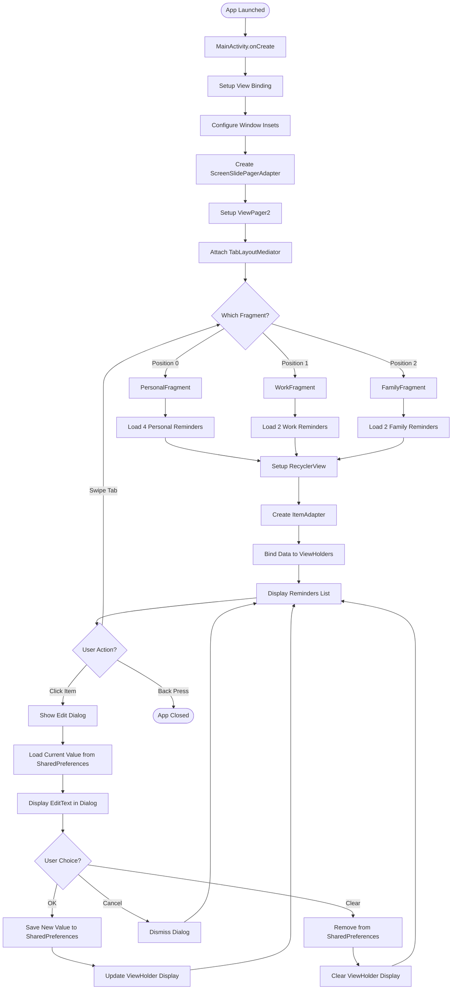
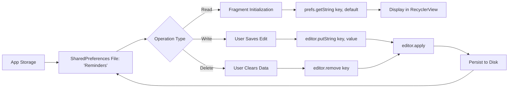
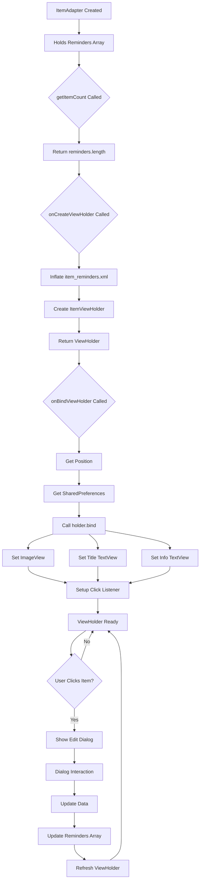
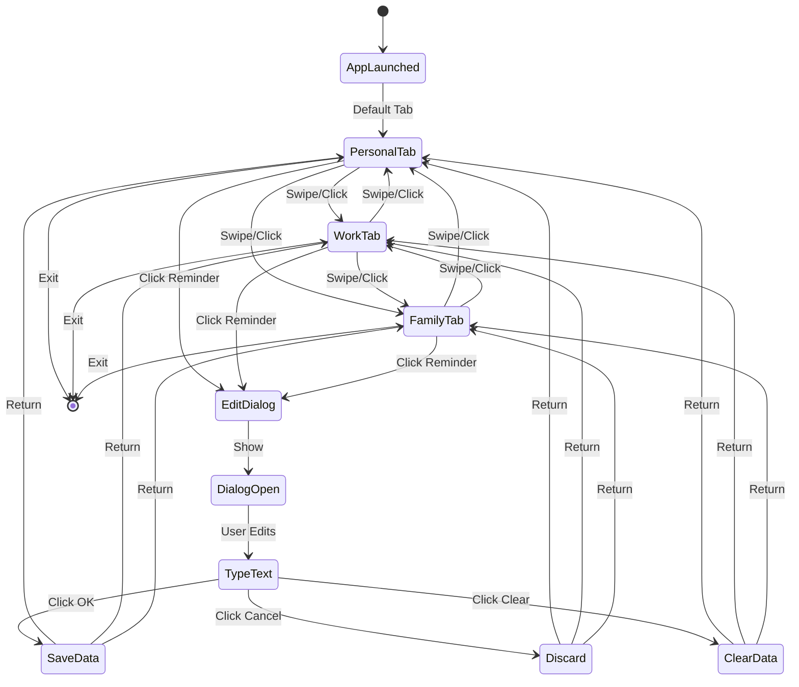

# Android Reminders App - Java Architecture Documentation

## Table of Contents
1. [Project Overview](#project-overview)
2. [Architecture Pattern](#architecture-pattern)
3. [Core Components](#core-components)
4. [Component Relationships](#component-relationships)
5. [Data Flow](#data-flow)
6. [Detailed Component Analysis](#detailed-component-analysis)
7. [Flowcharts](#flowcharts)
8. [Key Design Patterns](#key-design-patterns)
9. [Memory Management](#memory-management)

---

## Project Overview

This is an Android application that helps users manage reminders across three categories:
- **Personal**: Phone passwords, UPI pins, bike locks, metro cards
- **Work**: Roll numbers, student IDs
- **Family**: Door locks, WiFi passwords

The app uses local storage (SharedPreferences) to persist reminder information.

---

## Architecture Pattern

The app follows a **Fragment-based architecture** with **ViewPager2** for tab navigation:

```
MainActivity (Host Activity)
    ├── ViewPager2 (Fragment Container)
    │   ├── PersonalFragment
    │   ├── WorkFragment
    │   └── FamilyFragment
    └── TabLayout (Navigation Tabs)
```

---

## Core Components

### 1. **MainActivity.java**
- **Role**: Entry point and host activity
- **Responsibilities**:
  - Sets up ViewPager2 for fragment navigation
  - Manages TabLayout with 3 tabs
  - Handles system window insets for edge-to-edge display
  - Contains inner adapter class for fragment management

### 2. **Reminders.java** (Record Class)
- **Role**: Data model
- **Type**: Java Record (immutable data carrier)
- **Fields**:
  - `String title` - The reminder name
  - `String info` - The reminder content/value
  - `int image` - Resource ID for the icon

### 3. **ItemAdapter.java**
- **Role**: RecyclerView adapter
- **Responsibilities**:
  - Binds reminder data to UI
  - Handles click events on reminder items
  - Manages dialog for editing reminders
  - Performs CRUD operations with SharedPreferences

### 4. **Fragment Classes** (3 types)
- **PersonalFragment.java**
- **WorkFragment.java**
- **FamilyFragment.java**
- **Common Responsibilities**:
  - Initialize category-specific reminders
  - Set up RecyclerView with ItemAdapter
  - Load data from SharedPreferences
  - Manage fragment lifecycle

---

## Component Relationships



---

## Data Flow

### Application Startup Flow



### User Interaction Flow (Edit Reminder)



---

## Detailed Component Analysis

### 1. MainActivity - The Application Host

**Key Responsibilities:**

```java
// 1. View Binding Setup
binding = ActivityMainBinding.inflate(getLayoutInflater());
setContentView(binding.getRoot());

// 2. Window Insets Handling (Edge-to-Edge Display)
ViewCompat.setOnApplyWindowInsetsListener(binding.getRoot(), ...)

// 3. ViewPager2 Configuration
binding.fragmentContainer.setAdapter(new ScreenSlidePagerAdapter(this));

// 4. Tab-Fragment Synchronization
new TabLayoutMediator(binding.tabLayout, binding.fragmentContainer, ...)
```

**Inner Class: ScreenSlidePagerAdapter**
- Extends `FragmentStateAdapter`
- Manages 3 fragments in a stateful manner
- Handles fragment creation based on position
- Returns total count of fragments (3)

**Tab Configuration Strategy:**
```
Position 0: Personal Tab (icons8_personal icon)
Position 1: Work Tab (icons8_work icon)
Position 2: Family Tab (icons8_family icon)
```

---

### 2. Reminders - The Data Model

**Modern Java Record:**
```java
public record Reminders(String title, String info, int image) { }
```

**Characteristics:**
- **Immutable**: Once created, fields cannot be changed
- **Automatic methods**: Equals, hashCode, toString auto-generated
- **Constructor**: All-args constructor provided by default
- **Getters**: Accessor methods named after fields (title(), info(), image())

**Why Record?**
- Reduces boilerplate code
- Ensures data immutability
- Thread-safe by design
- Clear intent: "This is just data"

---

### 3. ItemAdapter - The RecyclerView Bridge

**Architecture:**
```
ItemAdapter
    ├── Field: Reminders[] reminders
    ├── Method: getItemCount()
    ├── Method: onCreateViewHolder()
    ├── Method: onBindViewHolder()
    └── Inner Class: ItemViewHolder
        ├── Fields: imageview, heading, info
        ├── Constructor: ItemViewHolder(View)
        └── Method: bind(Reminders)
```

**Key Operations:**

#### A. ViewHolder Creation
```java
onCreateViewHolder() {
    // Inflate item_reminders.xml layout
    // Return new ItemViewHolder instance
}
```

#### B. Data Binding
```java
onBindViewHolder(holder, position) {
    // 1. Get SharedPreferences instance
    // 2. Bind reminder data to ViewHolder
    // 3. Set click listener for edit dialog
}
```

#### C. Edit Dialog Management

**Dialog Flow:**


**Dialog Buttons:**
1. **Positive (OK)**: 
   - Saves new text to SharedPreferences
   - Updates the reminders array
   - Refreshes the ViewHolder display

2. **Negative (Cancel)**:
   - Simply dismisses dialog
   - No changes made

3. **Neutral (Clear)**:
   - Removes key from SharedPreferences
   - Clears the info text
   - Updates reminders array with empty string

---

### 4. Fragment Classes - Category Containers

All three fragments follow the **same structure** but with different data:

**Lifecycle Methods:**



#### PersonalFragment
**Reminders:**
- Phone Password → phone_icon
- UPI Pin → upi_icon
- Bike Lock → bike_icon
- Metro Card → metro_card

#### WorkFragment
**Reminders:**
- Roll NO. → roll_student
- Student ID → student_ic

#### FamilyFragment
**Reminders:**
- Door Lock → door_lockl
- Wifi Password → wifi_pass

**Common Pattern:**
```java
// 1. Access SharedPreferences
prefs = requireActivity().getSharedPreferences("Reminders", Context.MODE_PRIVATE);

// 2. Create reminders array with saved values
Reminders[] reminders = new Reminders[]{
    new Reminders("Title", prefs.getString("Title", ""), R.drawable.icon),
    // ... more reminders
};

// 3. Setup adapter
ItemAdapter adapter = new ItemAdapter(reminders);
recyclerview.setAdapter(adapter);
```

---

## Flowcharts

### Complete Application Flow



### SharedPreferences Data Flow



### RecyclerView Adapter Pattern



---

## Key Design Patterns

### 1. **Adapter Pattern**
- **Used in**: ItemAdapter, ScreenSlidePagerAdapter
- **Purpose**: Bridge between data and UI components
- **Benefits**: Separates data management from view rendering

### 2. **ViewHolder Pattern**
- **Used in**: ItemViewHolder (inner class)
- **Purpose**: Cache view references for RecyclerView efficiency
- **Benefits**: Reduces findViewById calls, improves scrolling performance

### 3. **Fragment Pattern**
- **Used in**: All three fragment classes
- **Purpose**: Modular UI components with lifecycle management
- **Benefits**: Reusability, independent lifecycle, configuration handling

### 4. **Observer Pattern (Implicit)**
- **Used in**: TabLayoutMediator
- **Purpose**: Sync TabLayout with ViewPager2
- **Benefits**: Automatic tab-page synchronization

### 5. **Record Pattern (Data Class)**
- **Used in**: Reminders record
- **Purpose**: Immutable data carrier
- **Benefits**: Thread-safety, less boilerplate, clear intent

### 6. **View Binding Pattern**
- **Used in**: All activities and fragments
- **Purpose**: Type-safe view access
- **Benefits**: Null-safety, compile-time verification

---

## Memory Management

### View Binding Cleanup
```java
@Override
public void onDestroyView() {
    super.onDestroyView();
    binding = null;  // Prevent memory leaks
}
```

**Why?**
- Fragments outlive their views
- Views can be recreated (configuration changes)
- Setting binding to null allows garbage collection

### RecyclerView Efficiency

**ViewHolder Reuse:**
- ViewHolders are recycled as user scrolls
- Only visible items are in memory
- Off-screen ViewHolders are reused for new items

**Position Handling:**
```java
int currentPosition = holder.getAdapterPosition();
if (currentPosition == RecyclerView.NO_POSITION) {
    return;  // Prevents crashes during animations/removals
}
```

---

## Data Persistence

### SharedPreferences Structure

```
Reminders.xml (in app's private storage)
├── "Phone Password" → "encrypted_value"
├── "UPI Pin" → "1234"
├── "Bike Lock" → "5678"
├── "Metro Card" → "9876543210"
├── "Roll NO." → "21BCE1234"
├── "Student ID" → "ST1234"
├── "Door Lock" → "0000"
└── "Wifi Password" → "HomeWiFi2023"
```

**Key-Value Pairs:**
- **Key**: Reminder title (String)
- **Value**: Reminder info (String)
- **Mode**: `MODE_PRIVATE` (only accessible by this app)

**Operations:**
- **Read**: `prefs.getString(key, defaultValue)`
- **Write**: `editor.putString(key, value); editor.apply()`
- **Delete**: `editor.remove(key); editor.apply()`

---

## Component Communication

### MainActivity ↔ Fragments
- **Method**: ScreenSlidePagerAdapter
- **Communication**: Fragment creation on demand
- **Data Flow**: One-way (MainActivity creates, doesn't receive)

### Fragments ↔ ItemAdapter
- **Method**: Constructor injection
- **Communication**: Reminders array passed to adapter
- **Data Flow**: One-way (Fragment provides, adapter displays)

### ItemAdapter ↔ SharedPreferences
- **Method**: Direct access via Context
- **Communication**: Read/Write operations
- **Data Flow**: Bidirectional (read on load, write on edit)

### ViewPager2 ↔ TabLayout
- **Method**: TabLayoutMediator
- **Communication**: Position synchronization
- **Data Flow**: Bidirectional (tabs change pages, pages change tabs)

---

## Code Organization

```
com.anantjava.reminders/
├── MainActivity.java          [Entry Point]
├── Reminders.java            [Data Model]
├── ItemAdapter.java          [RecyclerView Logic]
├── personal/
│   └── PersonalFragment.java [Personal Category]
├── work/
│   └── WorkFragment.java     [Work Category]
└── family/
    └── FamilyFragment.java   [Family Category]
```

**Package Structure Benefits:**
- Clear separation by feature
- Easy to locate files
- Scalable for future additions

---

## Threading & Performance

### Main Thread Operations
- All UI updates
- SharedPreferences operations (lightweight)
- Fragment lifecycle callbacks
- RecyclerView binding

### Why No Background Threads?
- SharedPreferences operations are fast
- Small dataset (max 8 items total)
- No network operations
- No heavy computations

**Performance Characteristics:**
- O(1) SharedPreferences access
- O(n) RecyclerView binding (n = items per fragment, max 4)
- Efficient ViewHolder recycling

---

## User Experience Flow



---

## Summary

### Core Technologies
- **UI Framework**: Android ViewBinding
- **Navigation**: ViewPager2 + TabLayout
- **Lists**: RecyclerView + Adapter pattern
- **Data**: Java Records
- **Storage**: SharedPreferences
- **Dialogs**: MaterialAlertDialog

### Architecture Strengths
✅ **Modular**: Each fragment is independent  
✅ **Maintainable**: Clear separation of concerns  
✅ **Efficient**: ViewHolder pattern + data recycling  
✅ **Type-Safe**: View Binding + Records  
✅ **User-Friendly**: Material Design dialogs  

### Data Flow Summary
1. **App Start** → Load SharedPreferences → Display in RecyclerView
2. **User Edit** → Show Dialog → Save to SharedPreferences → Update UI
3. **Tab Switch** → Fragment recreation → Fresh data load

### Key Takeaways
- Simple yet effective architecture
- Proper memory management with binding cleanup
- Immutable data models (Record)
- Efficient list rendering (RecyclerView)
- Persistent storage (SharedPreferences)
- Modern Android components (ViewPager2, Material dialogs)

---

## Future Enhancement Possibilities

1. **Database Integration**: Replace SharedPreferences with Room
2. **Search Functionality**: Add search bar to filter reminders
3. **Categories Management**: Dynamic category creation
4. **Data Export**: Backup/restore functionality
5. **Encryption**: Secure sensitive information
6. **Cloud Sync**: Firebase integration
7. **Biometric Lock**: Secure app access
8. **Notifications**: Reminder notifications

---

*Documentation generated for OOPs-Project*  
*Date: November 10, 2025*
